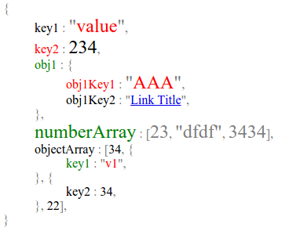

Object Styler
===============

show javascript object in html with styles and colors for every key:value pair.

Example
------------

```js
var styler = new ObjectStyler.Styler({punctuation: "codeSyl", blockIndent : "indentedSyl", endLine: "endLineSyl"}, [
    {name: "codeSyl", className: "grey"},
    {name: "greenSyl", className: "green"},
    {name: "redSyl", className: "red"},
    {name: "endLineSyl", className: "endl"},
    {name: "bigSyl", className: "big"},
    {name: "indentedSyl", className: "indentedBlock"},
    {name: "fancy", className: "big red"},
]);

var obj = {
    key1 : "value",
    key2 : 234,
    obj1 : {
        obj1Key1 : "AAA",
        obj1Key2 : "!!link,, LINK_URL,, Link Title"
    },
    numberArray : [23,"dfdf",3434],
    objectArray : [34, {key1:"v1"}, {key2:34}, 22]
}

var style = {
    key2 : {k:'redSyl',v:'bigSyl'},
    key1 : {v:'fancy'},
    obj1 : {k:'greenSyl', v: {
        obj1Key1 : {k:'redSyl', v:'fancy'}
    }},
    numberArray : {k:['bigSyl', 'greenSyl'], v: ['bigSyl', 'codeSyl']}
}

document.body.innerHTML = styler.style(obj,style);
```

Result :

```html
<span class="grey">{</span>
<div class="indentedBlock"><span>key1</span><span class="grey"> : </span><span class="grey">"</span><span class="big red">value</span><span class="grey">"</span><span class="grey endl">,</span><span class="red">key2</span><span class="grey"> : </span><span class="big">234</span><span class="grey endl">,</span><span class="green">obj1</span><span class="grey"> : </span><span class="grey">{</span>
    <div class="indentedBlock"><span class="red">obj1Key1</span><span class="grey"> : </span><span class="grey">"</span><span class="big red">AAA</span><span class="grey">"</span><span class="grey endl">,</span><span>obj1Key2</span><span class="grey"> : </span><span class="grey">"</span><span><a href="LINK_URL">Link Title</a></span><span class="grey">"</span><span class="grey endl">,</span></div><span class="grey">}</span><span class="grey endl">,</span><span class="green big">numberArray</span><span class="grey"> : </span><span class="grey">[</span><span class="grey big">23</span><span class="grey">, </span><span class="grey">"</span><span class="grey big">dfdf</span><span class="grey">"</span><span class="grey">, </span><span class="grey big">3434</span><span class="grey">]</span><span class="grey endl">,</span><span>objectArray</span><span class="grey"> : </span><span class="grey">[</span><span>34</span><span class="grey">, </span><span class="grey">{</span>
    <div class="indentedBlock"><span>key1</span><span class="grey"> : </span><span class="grey">"</span><span>v1</span><span class="grey">"</span><span class="grey endl">,</span></div><span class="grey">}</span><span class="grey">, </span><span class="grey">{</span>
    <div class="indentedBlock"><span>key2</span><span class="grey"> : </span><span>34</span><span class="grey endl">,</span></div><span class="grey">}</span><span class="grey">, </span><span>22</span><span class="grey">]</span><span class="grey endl">,</span></div><span class="grey">}</span>
```


